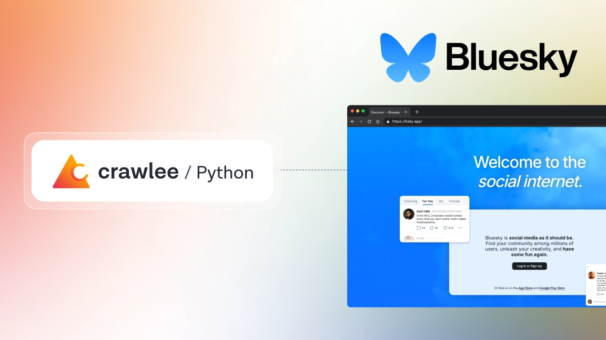
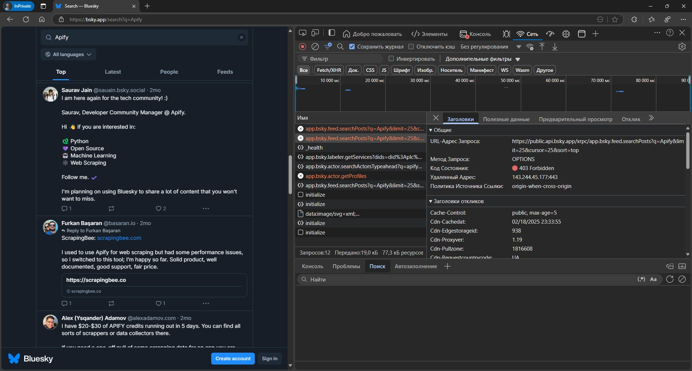
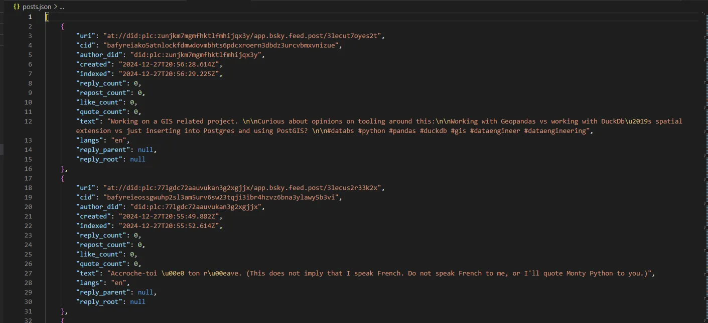
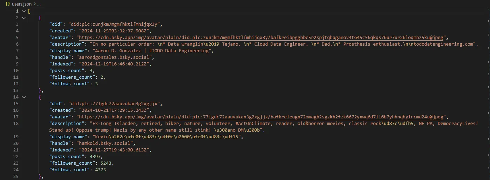
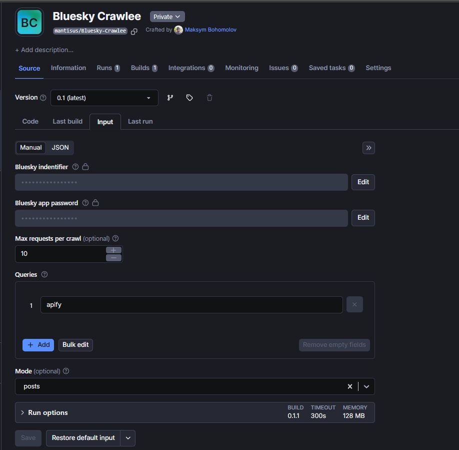
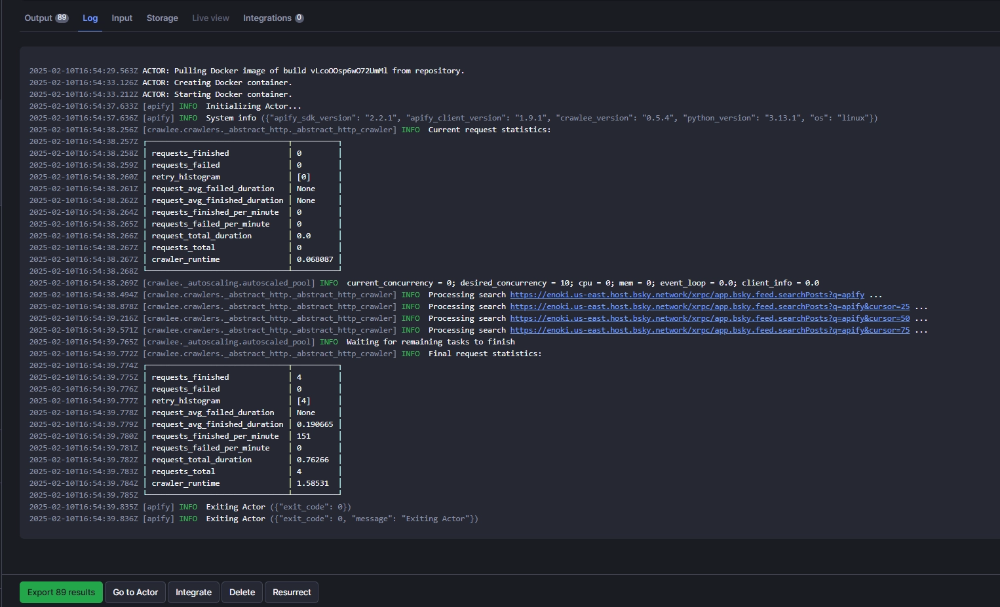

[Bluesky](https://bsky.app/) is an emerging social network developed by former members of the [Twitter](https://x.com/)(now X) development team. The platform has been showing significant growth recently, reaching 140.3 million visits according to [SimilarWeb](https://www.similarweb.com/website/bsky.app/#traffic). Like X, luesky generates a vast amount of data that can be used for analysis. In this article, we’ll  explore how to collect this data using [Crawlee for Python](https://github.com/apify/crawlee-python).

:::note

One of our community members wrote this blog as a contribution to the Crawlee Blog. If you’d like to contribute articles like these, please reach out to us on our [discord channel](https://apify.com/discord).

:::



Key steps we will cover:

1. Project setup
2. Development of the Bluesky crawler in Python
3. Create Apify Actor for Bluesky crawler
4. Conclusion and repository access

<!-- truncate -->

## Prerequisites

- Basic understanding of web scraping concepts
- Python 3.9 or higher
- [UV](https://docs.astral.sh/uv/) version 0.6.0 or higher
- Crawlee for Python v0.6.5 or higher
- Bluesky account for API access

### Project setup

In this project, we’ll use UV for package management and a specific Python version installed through UV. UV is a fast and modern package manager written in Rust.

1. If you don’t have UV installed yet, follow the [guide](https://docs.astral.sh/uv/getting-started/installation/) or use this command:

    ```bash
    curl -LsSf https://astral.sh/uv/install.sh | sh
    ```

2. Install standalone Python using UV:

    ```bash
    uv install python 3.13
    ```

3. Create a new project and install Crawlee for Python:

    ```bash
    uv init bluesky-crawlee --package
    cd bluesky-crawlee
    uv add crawlee
    ```

We’ve created a new isolated Python project with all the necessary dependencies for Crawlee.

## Development of the Bluesky crawler in Python

### 1. Identifying the data source

When accessing the [search page](https://bsky.app/search?q=apify), you'll see data displayed, but be aware of a key limitation: the site only allows viewing the first page of results, preventing access to any additional pages.



Fortunately, Bluesky provides a well-documented [API](https://docs.bsky.app/docs/get-started) that is accessible to any registered user without additional permissions. This is what we’ll use for data collection

### 2. Creating a session for API interaction

:::note

For secure API interaction, you need to create a dedicated app password instead of using your main account password.

Go to Settings -> Privacy and Security -> [App Passwords](https://bsky.app/settings/app-passwords) and click *Add App Password*.
Important: Save the generated password, as it won’t be visible after creation.

:::

Next, create environment variables to store your credentials:

- Your application password
- Your user identifier (found in your profile and Bluesky URL, for example: [`mantisus.bsky.social`](https://bsky.app/profile/mantisus.bsky.social))

```bash
export BLUESKY_APP_PASSWORD=your_app_password
export BLUESKY_IDENTIFIER=your_identifier
```

Using the [createSession](https://docs.bsky.app/docs/api/com-atproto-server-create-session), [deleteSession](https://docs.bsky.app/docs/api/com-atproto-server-delete-session) endpoints and [`httpx`](https://www.python-httpx.org/), we can create a session for API interaction.

Let us create a class with the necessary methods:

```python
import asyncio
import json
import os
import traceback

import httpx
from yarl import URL

from crawlee import ConcurrencySettings, Request
from crawlee.configuration import Configuration
from crawlee.crawlers import HttpCrawler, HttpCrawlingContext
from crawlee.http_clients import HttpxHttpClient
from crawlee.storages import Dataset

# Environment variables for authentication
# BLUESKY_APP_PASSWORD: App-specific password generated from Bluesky settings
# BLUESKY_IDENTIFIER: Your Bluesky handle (e.g., username.bsky.social)
BLUESKY_APP_PASSWORD = os.getenv('BLUESKY_APP_PASSWORD')
BLUESKY_IDENTIFIER = os.getenv('BLUESKY_IDENTIFIER')


class BlueskyApiScraper:
    """A scraper class for extracting data from Bluesky social network using their official API.

    This scraper manages authentication, concurrent requests, and data collection for both
    posts and user profiles. It uses separate datasets for storing post and user information.
    """

    def __init__(self) -> None:
        self._crawler: HttpCrawler | None = None

        self._users: Dataset | None = None
        self._posts: Dataset | None = None

        # Variables for storing session data
        self._service_endpoint: str | None = None
        self._user_did: str | None = None
        self._access_token: str | None = None
        self._refresh_token: str | None = None
        self._handle: str | None = None

    def create_session(self) -> None:
        """Create credentials for the session."""
        url = 'https://bsky.social/xrpc/com.atproto.server.createSession'
        headers = {
            'Content-Type': 'application/json',
        }
        data = {'identifier': BLUESKY_IDENTIFIER, 'password': BLUESKY_APP_PASSWORD}

        response = httpx.post(url, headers=headers, json=data)
        response.raise_for_status()

        data = response.json()

        self._service_endpoint = data['didDoc']['service'][0]['serviceEndpoint']
        self._user_did = data['didDoc']['id']
        self._access_token = data['accessJwt']
        self._refresh_token = data['refreshJwt']
        self._handle = data['handle']

    def delete_session(self) -> None:
        """Delete the current session."""
        url = f'{self._service_endpoint}/xrpc/com.atproto.server.deleteSession'
        headers = {'Content-Type': 'application/json', 'authorization': f'Bearer {self._refresh_token}'}

        response = httpx.post(url, headers=headers)
        response.raise_for_status()
```

The session expires after 2 hours, so if you plan for your crawler to run longer, you should also add a method for [refresh](https://docs.bsky.app/docs/api/com-atproto-server-refresh-session).

### 3. Configuring Crawlee for Python for data collection

Since we’ll be using the official API, we do not need to worry about being blocked by Bluesky. However, we should be careful with the number of requests to avoid overloading Bluesky's servers, so we will configure [`ConcurrencySettings`](https://www.crawlee.dev/python/api/class/ConcurrencySettings). We’ll also configure [`HttpxHttpClient`](https://www.crawlee.dev/python/api/class/HttpxHttpClient) to use custom headers with the current session's `Authorization`.

We’ll use 2 endpoints for data collection: [searchPosts](https://docs.bsky.app/docs/api/app-bsky-feed-search-posts) for posts and [getProfile](https://docs.bsky.app/docs/api/app-bsky-actor-get-profile). If you plan to scale the crawler, you can use [getProfiles](https://docs.bsky.app/docs/api/app-bsky-actor-get-profiles) for user data, but in this case, you’ll need to implement deduplication logic. When each link is unique, Crawlee for Python handles this for you.

When collecting data, I’d like to separately collect user and post data, so we’ll use different [`Dataset`](https://www.crawlee.dev/python/api/class/Dataset) instances for storage.

```python
async def init_crawler(self) -> None:
    """Initialize the crawler."""
    if not self._user_did:
        raise ValueError('Session not created.')

    # Initialize the datasets purge the data if it is not empty
    self._users = await Dataset.open(name='users', configuration=Configuration(purge_on_start=True))
    self._posts = await Dataset.open(name='posts', configuration=Configuration(purge_on_start=True))

    # Initialize the crawler
    self._crawler = HttpCrawler(
        max_requests_per_crawl=100,
        http_client=HttpxHttpClient(
            # Set headers for API requests
            headers={
                'Content-Type': 'application/json',
                'Authorization': f'Bearer {self._access_token}',
                'Connection': 'Keep-Alive',
                'accept-encoding': 'gzip, deflate, br, zstd',
            }
        ),
        # Configuring concurrency of crawling requests
        concurrency_settings=ConcurrencySettings(
            min_concurrency=10,
            desired_concurrency=10,
            max_concurrency=30,
            max_tasks_per_minute=200,
        ),
    )

    self._crawler.router.default_handler(self._search_handler)  # Handler for search requests
    self._crawler.router.handler(label='user')(self._user_handler)  # Handler for user requests
```

### 4. Implementing handlers for data collection

Now we can implement the handler for searching posts. We’ll save the retrieved posts in `self._posts` and create requests for user data, placing them in the crawler's queue. We also need to handle pagination by forming the link to the next search page.

```python
async def _search_handler(self, context: HttpCrawlingContext) -> None:
    context.log.info(f'Processing search {context.request.url} ...')

    data = json.loads(context.http_response.read())

    if 'posts' not in data:
        context.log.warning(f'No posts found in response: {context.request.url}')
        return

    user_requests = {}
    posts = []

    profile_url = URL(f'{self._service_endpoint}/xrpc/app.bsky.actor.getProfile')

    for post in data['posts']:
        # Add user request if not already added in current context
        if post['author']['did'] not in user_requests:
            user_requests[post['author']['did']] = Request.from_url(
                url=str(profile_url.with_query(actor=post['author']['did'])),
                user_data={'label': 'user'},
            )

        posts.append(
            {
                'uri': post['uri'],
                'cid': post['cid'],
                'author_did': post['author']['did'],
                'created': post['record']['createdAt'],
                'indexed': post['indexedAt'],
                'reply_count': post['replyCount'],
                'repost_count': post['repostCount'],
                'like_count': post['likeCount'],
                'quote_count': post['quoteCount'],
                'text': post['record']['text'],
                'langs': '; '.join(post['record'].get('langs', [])),
                'reply_parent': post['record'].get('reply', {}).get('parent', {}).get('uri'),
                'reply_root': post['record'].get('reply', {}).get('root', {}).get('uri'),
            }
        )

    await self._posts.push_data(posts)  # Push a batch of posts to the dataset
    await context.add_requests(list(user_requests.values()))

    if cursor := data.get('cursor'):
        next_url = URL(context.request.url).update_query({'cursor': cursor})  # Use yarl for update the query string

        await context.add_requests([str(next_url)])
```

When receiving user data, we'll store it in the corresponding Dataset `self._users`

```python
async def _user_handler(self, context: HttpCrawlingContext) -> None:
    context.log.info(f'Processing user {context.request.url} ...')

    data = json.loads(context.http_response.read())

    user_item = {
        'did': data['did'],
        'created': data['createdAt'],
        'avatar': data.get('avatar'),
        'description': data.get('description'),
        'display_name': data.get('displayName'),
        'handle': data['handle'],
        'indexed': data.get('indexedAt'),
        'posts_count': data['postsCount'],
        'followers_count': data['followersCount'],
        'follows_count': data['followsCount'],
    }

    await self._users.push_data(user_item)
```

### 5. Saving data to files

For saving results, we will use the [`write_to_json`](https://www.crawlee.dev/python/api/class/Dataset#write_to_json).

```python
async def save_data(self) -> None:
    """Save the data."""
    if not self._users or not self._posts:
        raise ValueError('Datasets not initialized.')

    with open('users.json', 'w') as f:
        await self._users.write_to_json(f, indent=4)

    with open('posts.json', 'w') as f:
        await self._posts.write_to_json(f, indent=4)
```

### 6. Running the crawler

We have everything needed to complete the crawler. We just need a method to execute the crawling - let us call it `crawl`

```python
async def crawl(self, queries: list[str]) -> None:
    """Crawl the given URL."""
    if not self._crawler:
        raise ValueError('Crawler not initialized.')

    search_url = URL(f'{self._service_endpoint}/xrpc/app.bsky.feed.searchPosts')

    await self._crawler.run([str(search_url.with_query(q=query)) for query in queries])
```

Let's finalize the code:

```python
async def run() -> None:
    """Main execution function that orchestrates the crawling process.

    Creates a scraper instance, manages the session, and handles the complete
    crawling lifecycle including proper cleanup on completion or error.
    """
    scraper = BlueskyApiScraper()
    scraper.create_session()
    try:
        await scraper.init_crawler()
        await scraper.crawl(['python', 'apify', 'crawlee'])
        await scraper.save_data()
    except Exception:
        traceback.print_exc()
    finally:
        scraper.delete_session()


def main() -> None:
    """Entry point for the crawler application."""
    asyncio.run(run())
```

If you check your `pyproject.toml`, you will see that UV created an entrypoint for running `bluesky-crawlee = "bluesky_crawlee:main"`, so we can run our crawler simply by executing:

```bash
uv run bluesky-crawlee
```

Let's look at sample results:

Posts



Users



## Create Apify Actor for Bluesky crawler

We already have a fully functional implementation for local execution. Let us explore how to adapt it for running on the [Apify Platform](https://apify.com/) and transform in [Apify Actor](https://docs.apify.com/platform/actors).

An Actor is a simple and efficient way to deploy your code in the cloud infrastructure on the Apify Platform. You can flexibly interact with the Actor, [schedule regular runs](https://docs.apify.com/platform/schedules) for monitoring data, or [integrate](https://docs.apify.com/platform/integrations) with other tools to build data processing flows.

First, create an `.actor` directory with platform configuration files:

```bash
mkdir .actor && touch .actor/{actor.json,Dockerfile,input_schema.json}
```

Then add [Apify SDK for Python](https://docs.apify.com/sdk/python/) as a project dependency:

```bash
uv add apify
```

### Configure Dockerfile

We’ll use the official [Apify Docker image](https://docs.apify.com/academy/deploying-your-code/docker-file) along with recommended [UV practices for Docker](https://docs.astral.sh/uv/guides/integration/docker/):

```dockerfile
FROM apify/actor-python:3.13

ENV PATH='/app/.venv/bin:$PATH'

WORKDIR /app

COPY --from=ghcr.io/astral-sh/uv:latest /uv /uvx /bin/

COPY pyproject.toml uv.lock ./

RUN uv sync --frozen --no-install-project --no-editable -q --no-dev

COPY . .

RUN uv sync --frozen --no-editable -q --no-dev

CMD ["bluesky-crawlee"]
```

Here, `bluesky-crawlee` refers to the entrypoint specified in `pyproject.toml`.

### Define project metadata in actor.json

The `actor.json` file contains project metadata for Apify Platform. Follow the [documentation for proper configuration](https://docs.apify.com/platform/actors/development/actor-definition/actor-json):

```json
{
  "actorSpecification": 1,
  "name": "Bluesky-Crawlee",
  "title": "Bluesky - Crawlee",
  "minMemoryMbytes": 128,
  "maxMemoryMbytes": 2048,
  "description": "Scrape data products from bluesky",
  "version": "0.1",
  "meta": {
    "templateId": "bluesky-crawlee"
  },
  "input": "./input_schema.json",
  "dockerfile": "./Dockerfile"
}
```

### Define Actor input parameters

Our crawler requires several external parameters. Let’s define them:

- identifier: User's Bluesky identifier (encrypted for security)
- appPassword: Bluesky app password (encrypted)
- queries: List of search queries for crawling
- maxRequestsPerCrawl: Optional limit for testing
- mode: Choose between collecting posts or user data who post on specific topics

Configure the input schema following the [specification](https://docs.apify.com/platform/actors/development/actor-definition/input-schema/specification/v1):

```json
{
  "title": "Bluesky - Crawlee",
  "type": "object",
  "schemaVersion": 1,
  "properties": {
    "identifier": {
      "title": "Bluesky identifier",
      "description": "Bluesky identifier for API login",
      "type": "string",
      "editor": "textfield",
      "isSecret": true
    },
    "appPassword": {
      "title": "Bluesky app password",
      "description": "Bluesky app password for API",
      "type": "string",
      "editor": "textfield",
      "isSecret": true
    },
    "maxRequestsPerCrawl": {
      "title": "Max requests per crawl",
      "description": "Maximum number of requests for crawling",
      "type": "integer"
    },
    "queries": {
      "title": "Queries",
      "type": "array",
      "description": "Search queries",
      "editor": "stringList",
      "prefill": [
        "apify"
      ],
      "example": [
        "apify",
        "crawlee"
      ]
    },
    "mode": {
      "title": "Mode",
      "type": "string",
      "description": "Collect posts or users who post on a topic",
      "enum": [
        "posts",
        "users"
      ],
      "default": "posts"
    }
  },
  "required": [
    "identifier",
    "appPassword",
    "queries",
    "mode"
  ]
}
```

### Update project code

Remove environment variables and parameterize the code according to the Actor input parameters. Replace named datasets with the default dataset.

Add Actor logging:

```python
# __init__.py

import logging

from apify.log import ActorLogFormatter

handler = logging.StreamHandler()
handler.setFormatter(ActorLogFormatter())

apify_client_logger = logging.getLogger('apify_client')
apify_client_logger.setLevel(logging.INFO)
apify_client_logger.addHandler(handler)

apify_logger = logging.getLogger('apify')
apify_logger.setLevel(logging.DEBUG)
apify_logger.addHandler(handler)
```

Update imports and entry point code:

```python
import asyncio
import json
import traceback
from dataclasses import dataclass

import httpx
from apify import Actor
from yarl import URL

from crawlee import ConcurrencySettings, Request
from crawlee.crawlers import HttpCrawler, HttpCrawlingContext
from crawlee.http_clients import HttpxHttpClient


@dataclass
class ActorInput:
    """Actor input schema."""
    identifier: str
    app_password: str
    queries: list[str]
    mode: str
    max_requests_per_crawl: Optional[int] = None


async def run() -> None:
    """Main execution function that orchestrates the crawling process.

    Creates a scraper instance, manages the session, and handles the complete
    crawling lifecycle including proper cleanup on completion or error.
    """
    async with Actor:
        raw_input = await Actor.get_input()
        actor_input = ActorInput(
            identifier=raw_input.get('indentifier', ''),
            app_password=raw_input.get('appPassword', ''),
            queries=raw_input.get('queries', []),
            mode=raw_input.get('mode', 'posts'),
            max_requests_per_crawl=raw_input.get('maxRequestsPerCrawl')
        )
        scraper = BlueskyApiScraper(actor_input.mode, actor_input.max_requests_per_crawl)
        try:
            scraper.create_session(actor_input.identifier, actor_input.app_password)

            await scraper.init_crawler()
            await scraper.crawl(actor_input.queries)
        except httpx.HTTPError as e:
            Actor.log.error(f'HTTP error occurred: {e}')
            raise
        except Exception as e:
            Actor.log.error(f'Unexpected error: {e}')
            traceback.print_exc()
        finally:
            scraper.delete_session()

def main() -> None:
    """Entry point for the scraper application."""
    asyncio.run(run())
```

Update methods with Actor input parameters:

```python
class BlueskyApiScraper:
    """A scraper class for extracting data from Bluesky social network using their official API.

    This scraper manages authentication, concurrent requests, and data collection for both
    posts and user profiles. It uses separate datasets for storing post and user information.
    """

    def __init__(self, mode: str, max_request: int | None) -> None:
        self._crawler: HttpCrawler | None = None

        self.mode = mode
        self.max_request = max_request

        # Variables for storing session data
        self._service_endpoint: str | None = None
        self._user_did: str | None = None
        self._access_token: str | None = None
        self._refresh_token: str | None = None
        self._handle: str | None = None

    def create_session(self, identifier: str, password: str) -> None:
        """Create credentials for the session."""
        url = 'https://bsky.social/xrpc/com.atproto.server.createSession'
        headers = {
            'Content-Type': 'application/json',
        }
        data = {'identifier': identifier, 'password': password}

        response = httpx.post(url, headers=headers, json=data)
        response.raise_for_status()

        data = response.json()

        self._service_endpoint = data['didDoc']['service'][0]['serviceEndpoint']
        self._user_did = data['didDoc']['id']
        self._access_token = data['accessJwt']
        self._refresh_token = data['refreshJwt']
        self._handle = data['handle']
```

Implement mode-aware data collection logic:

```python
async def _search_handler(self, context: HttpCrawlingContext) -> None:
    """Handle search requests based on mode."""
    context.log.info(f'Processing search {context.request.url} ...')

    data = json.loads(context.http_response.read())

    if 'posts' not in data:
        context.log.warning(f'No posts found in response: {context.request.url}')
        return

    user_requests = {}
    posts = []

    profile_url = URL(f'{self._service_endpoint}/xrpc/app.bsky.actor.getProfile')

    for post in data['posts']:
        if self.mode == 'users' and post['author']['did'] not in user_requests:
            user_requests[post['author']['did']] = Request.from_url(
                url=str(profile_url.with_query(actor=post['author']['did'])),
                user_data={'label': 'user'},
            )
        elif self.mode == 'posts':
            posts.append(
                {
                    'uri': post['uri'],
                    'cid': post['cid'],
                    'author_did': post['author']['did'],
                    'created': post['record']['createdAt'],
                    'indexed': post['indexedAt'],
                    'reply_count': post['replyCount'],
                    'repost_count': post['repostCount'],
                    'like_count': post['likeCount'],
                    'quote_count': post['quoteCount'],
                    'text': post['record']['text'],
                    'langs': '; '.join(post['record'].get('langs', [])),
                    'reply_parent': post['record'].get('reply', {}).get('parent', {}).get('uri'),
                    'reply_root': post['record'].get('reply', {}).get('root', {}).get('uri'),
                }
            )

    if self.mode == 'posts':
        await context.push_data(posts)
    else:
        await context.add_requests(list(user_requests.values()))

    if cursor := data.get('cursor'):
        next_url = URL(context.request.url).update_query({'cursor': cursor})
        await context.add_requests([str(next_url)])
```

Update the user handler for the default dataset:

```python
async def _user_handler(self, context: HttpCrawlingContext) -> None:
    """Handle user profile requests."""
    context.log.info(f'Processing user {context.request.url} ...')

    data = json.loads(context.http_response.read())

    user_item = {
        'did': data['did'],
        'created': data['createdAt'],
        'avatar': data.get('avatar'),
        'description': data.get('description'),
        'display_name': data.get('displayName'),
        'handle': data['handle'],
        'indexed': data.get('indexedAt'),
        'posts_count': data['postsCount'],
        'followers_count': data['followersCount'],
        'follows_count': data['followsCount'],
    }

    await context.push_data(user_item)
```

### Deploy

Use the official [Apify CLI](https://docs.apify.com/cli/) to upload your code:

Authenticate using your API token from [Apify Console](https://console.apify.com/settings/integrations):

```bash
apify login
```

Choose "Enter API token manually" and paste your token.

Push the project to the platform:

```bash
apify push
```

Now you can configure runs on Apify Platform.

Let’s perform a test run:

Fill in the input parameters:



Check that logging works correctly:



View results in the dataset:


If you want to make your Actor public and provide access to other users, potentially to earn income from it, follow this [publishing guide](https://docs.apify.com/platform/actors/publishing) for [Apify Store](https://apify.com/store).

## Conclusion and repository access

We’ve created an efficient crawler for Bluesky using the official API. If you want to learn more this topic for regular data extraction from Bluesky, I recommend explorin [custom feed generation](https://docs.bsky.app/docs/starter-templates/custom-feeds) - I think it opens up some interesting possibilities.

And if you need to quickly create a crawler that can retrieve data for various queries, you now have everything you need.

You can find the complete code in the [repository](https://github.com/Mantisus/bluesky-crawlee)

If you enjoyed this blog, feel free to support Crawlee for Python by starring the [repository](https://github.com/apify/crawlee-python) or joining the maintainer team.

Have questions or want to discuss implementation details? Join our [Discord](https://discord.com/invite/jyEM2PRvMU) - our community of 10,000+ developers is there to help.
